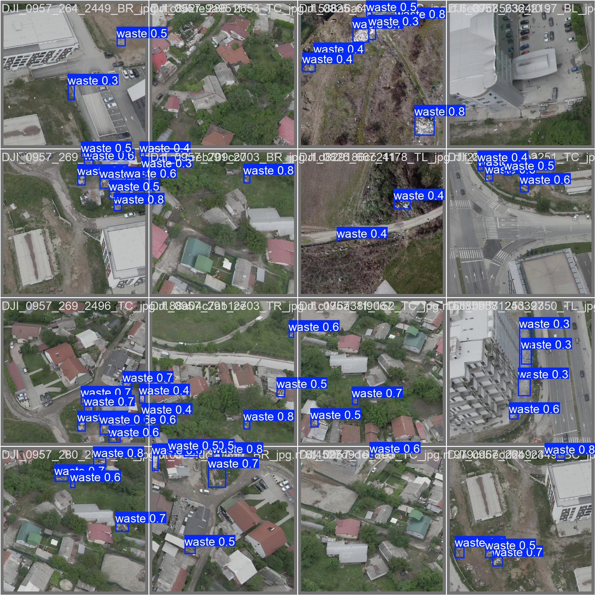

# KI Anwendung

## Überblick
WasteWing nutzt ein KI-System für die Erkennung illegalen Sperrmülls durch die Bilder der Drohnenkamera.
Die KI wurde mit YOLOv8 trainiert.

## Datensatz
Das Modell wurde mit dem Dumpsite Detection Dataset [1] trainiert.

### Datensatz Charakteristiken:
- Luftaufnahmen von Abfällen und Deponien
- Annotierte Bounding Boxes für Deponie-Regionen
- Ausgelegt für Objekterkennungsaufgaben
- Enthält Variationen in Maßstab, Gelände und Lichtverhältnissen


## Training
Das Modell kann mithilfe der `yolo`-Kommandozeilenanwendung von Ultralytics trainiert werden, wobei ein vortrainiertes Basismodell für allgemeine Objekterkennung (`yolov8n.pt`) verwendet wird:

```bash
yolo detect train model=yolov8n.pt data=data.yaml epochs=100 name=yolov8n_waste
```

## Ablauf der Inferenz
1. Die Drohnenkamera erfasst Live-Bilder
2. Die Bilder werden an einen lokalen Computer mit dem YOLOv8-Modell gesendet
3. Die Inferenz wird mit dem YOLOv8-Modell durchgeführt
4. Deponie-Erkennungen werden zurückgegeben mit:
   - Koordinaten der Bounding Box
   - Confidence Score
5. Die Ergebnisse werden verarbeitet und entsprechende Aktionsbefehle an die Drohne zurückgegeben


Verarbeteitete Bilder könnten so aussehen:



## Einschränkungen
Die Genauigkeit der Erkennung hängt von der Flughöhe und der Bildqualität ab. Außerdem kann die Leistung bei extremen Wetterbedingungen oder schlechter Sicht beeinträchtigt werden.

## Datensatz Referenz

[1] Dumpsite Detection Dataset.  
Work. *Roboflow Universe*, 2025.  
Available at: https://universe.roboflow.com/work-0sor9/dumpsite-detection-vynfo  
(Accessed: 2026-01-26)
