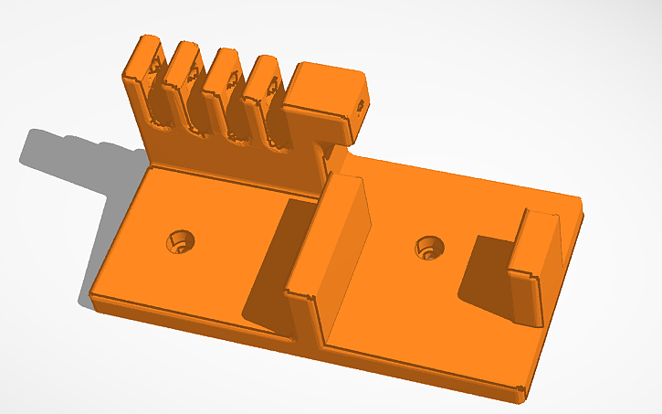
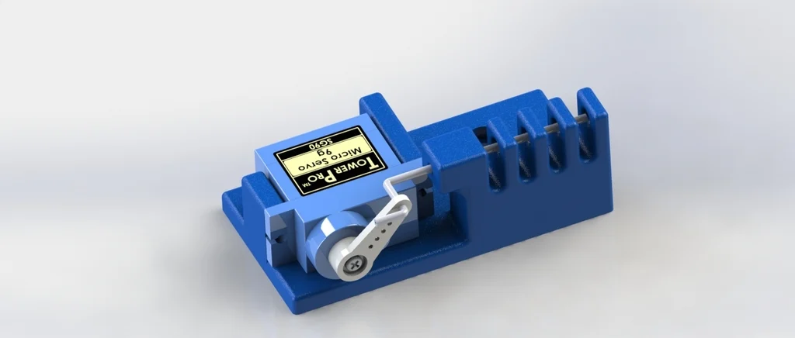

# Dropmechanismus

Der Zweck des Dropmechanismus ist das kontrollierte Abwerfen von Geo-Tags (z.B. Apple AirTag oder Samsung Galaxy SmartTag). Solche Geo-Tags kommunizieren mit Apple- bzw. Samsunggeräten in der Nähe und erlauben so eine extrem präzise Ortung innerhalb von weniger als 100m. In Kombination mit einem GPS-Marker, welcher auf ca. fünf Meter genau ist, kann so eine bis auf dem Meter genaue Ortung von illegal abgeladenem Müll im Freien sichergestellt werden. 

## Aufbau

Der Dropmechanismus besteht aus drei Einzelteilen:
1. Einer 3D gedruckten Halterung, welche mit Schrauben direkt an der Drohne befestigt wird
2. Einem 9g Micro Servomotor, befestigt an der Halterung
3. Einem Pin, welcher durch den Servomotor gezogen wird und so einen Geo-Tag fallen lässt

### Die Halterung

*Die Halterung mit angepassten Befestitungslöchern*

Als Vorlage für die Halterung diente uns [1]. Das Modell wurde mit Tinkercad angepasst, damit es an unserem Rahmen befestigt werden kann.

*Der komplette Dropmechanismus als 3D-Modell*

## Ansteuerung des Servomotors
Der Servomotor wird mit den  5V, GND und GPIO Anschlüssen des Raspberries verbunden. Im Anschluss wird der Servomotor mithilfe der Python GPIO Bibliothek angesteuert.  

## Referenz Vorlage Halterung
[1] Multiple Servo Drop
*alperssl*, 2017.  
Available at: https://www.thingiverse.com/thing:2435950
(Accessed: 2026-01-26)