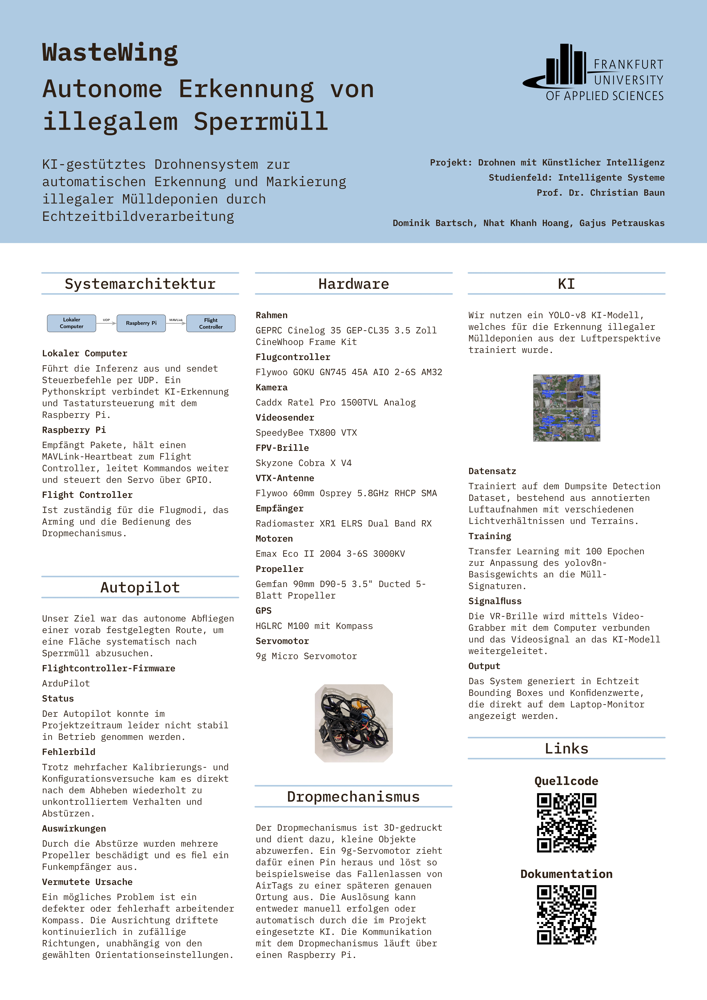

# WasteWing

KI-gestütztes Drohnensystem zur automatischen Erkennung und Markierung illegaler Mülldeponien durch Echtzeitbildverarbeitung.

## Projektinformation

Das Projekt wurde im Rahmen des Projektmoduls "Drohnen mit Künstlicher Intelligenz" aus dem Studienfeld "Intelligente Systeme" als Teil des M.Sc. Studiengangs "Allgemeine Informatik" an der Frankfurt University of Applied Sciences entwickelt. 

**Modulverantwortlicher**: Prof. Dr. Christian Baun

**Projektgruppe**:
- Dominik Bartsch
- Nhat Khanh Hoang
- Gajus Petrauskas

## Projektposter

## Links
* [Projektwebseite](https://www.christianbaun.de/Master_Projekt_WS2526/index.html)
* [Quellcode (GitHub)](https://github.com/domfoo/drone-project)